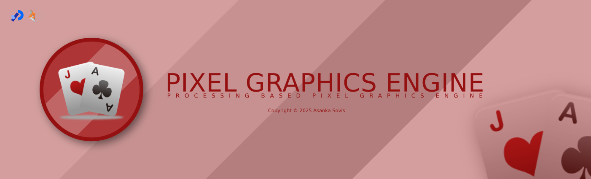

# 🎮 Pixel Graphics Engine

---

**Pixel Graphics Engine** is a Processing-based pixel art animation framework. It allows you to create, animate, and interact with pixel-based sprites on a customizable grid. The engine supports sprite movement, collision detection, animation, and various background effects, making it suitable for pixel art experiments and basic game development.

## 🎮 License
> Pixel Graphics Engine is licensed under the **GNU General Public License v3.0**.

Permissions of this strong copyleft license are conditioned on making available complete source code of licensed works and modifications, which include larger works using a licensed work, under the same license. Copyright and license notices must be preserved. Contributors provide an express grant of patent rights.

### Permissions
✔️ Commercial use | Modification | Distribution | Patent use | Private use

### Limitations
❌ Liability | Warranty

### Conditions
ℹ️ License and copyright notice | State changes | Disclose source | Same license 

Refer to the [License declaration](./LICENSE) for more details.

## 🎮 Features

- **Customizable Pixel Grid:** Set resolution, pixel size, and offset.
- **Sprite System:** Create and animate sprites with custom patterns and colors.
- **Sprite Behaviours:** Supports stationary, edge-stop, bounce, and wrap-around movement.
- **Collision Detection:** Sprites can detect and respond to collisions.
- **Background Effects:** Solid colour or patterned backgrounds.
- **Animation Control:** Keyframes, rotation, flipping, and auto-animation.
- **Extensible Logic:** Add custom behaviours per frame.

## 🎮 File Structure

```
.gitignore
README.md
Pixel_Graphics_Engine/
  contents.pde      # Sprite creation and initialization
  driver.pde        # Core engine: Driver, Sprite, Pattern classes
  logic.pde         # Per-frame custom logic
  Pixel_Graphics_Engine.pde# Main Processing sketch (entry point)
```

## 🎮 Getting Started

### Requirements

- [Processing](https://processing.org/) (Java mode)

### Running the Project

1. Open the `Pixel_Graphics_Engine` folder in Processing.
2. Run `Pixel_Graphics_Engine.pde`.

### Main Components

#### Pixel Grid

- **Resolution:** Set via `pixel_res` (`PVector(x, y)`)
- **Pixel Size:** Set via `pixel_size` (`PVector(x, y)`)
- **Offset:** Set via `pixel_offset` (`PVector(x, y)`)

#### Sprites

- Defined in [`contents.pde`](Pixel_Graphics_Engine/contents.pde)
- Created using the `Sprite` class ([`driver.pde`](Pixel_Graphics_Engine/driver.pde))
- Example: Five ball sprites with random colors and movement

#### Driver

- Manages pixel updates, rendering, and sprite interactions
- See [`Driver`](Pixel_Graphics_Engine/driver.pde)

#### Animation & Patterns

- Sprites use `Pattern` objects for animation frames
- Supports rotation, flipping, and keyframe control

#### Custom Logic

- Add per-frame behaviors in [`PerformLogic`](Pixel_Graphics_Engine/logic.pde)

## 🎮 How It Works

1. **Setup:** Initializes the pixel grid and driver, creates sprites.
2. **Draw Loop:** Each frame:
   - Executes custom logic (`PerformLogic`)
   - Updates pixel array via the driver (`UpdatePixels`)
   - Renders pixels to the canvas (`DrawPixels`)
   - Controls frame rate via delay

## 🎮 Sprite Behaviors

- **Drive Types:**
  - `0`: Stationary
  - `1`: Stop at edge
  - `2`: Bounce at edge
  - `3`: Wrap around edge

- **Collision Layers:** Sprites can be assigned to layers for selective collision detection.

- **Animation:** Sprites can auto-animate or be controlled manually.

## 🎮 Extending the Engine

- **Add Sprites:** Modify `CreateSprites()` in [`contents.pde`](Pixel_Graphics_Engine/contents.pde)
- **Custom Patterns:** Create new `Pattern` objects for different shapes/animations.
- **Logic:** Add game or animation logic in [`PerformLogic`](Pixel_Graphics_Engine/logic.pde)

## 🎮 Example: Creating a Ball Sprite

See [`return_ball`](Pixel_Graphics_Engine/contents.pde) for a sample sprite creation function.

---

> For more details, see the code comments

`© 2024 Asanka Sovis`